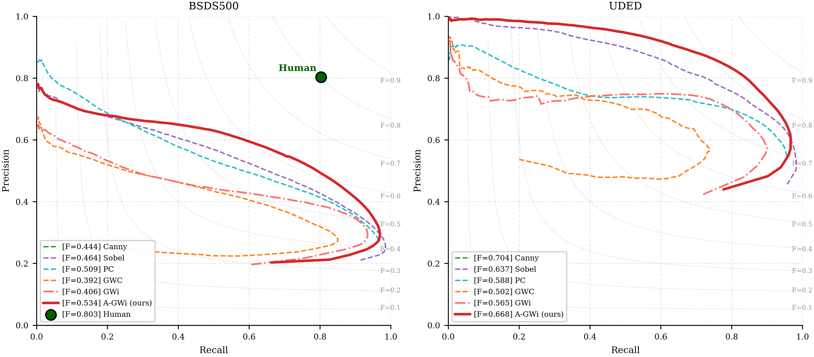
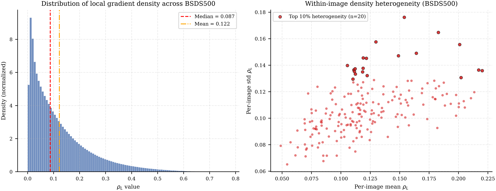

# A-GWi: Adaptive Imaginary Gabor Wavelet for Edge-Based Boundary Detection

> **Per-pixel kernel modulation via local gradient density, without training or GPU.**

This repository contains the evaluation code, experiment scripts, and figure-generation pipeline for the paper:

**K. Yudhistiro, N. Rijati, and R. S. Basuki, "Adaptive Imaginary Gabor Wavelet (A-GWi): Per-Pixel Kernel Modulation via Local Gradient Density for Edge-Based Boundary Detection,"**

---

## Key Results

A-GWi modulates the Gabor kernel frequency, scale, and size at each pixel based on a Sobel-derived local gradient density estimate (rho_L). It extends the static imaginary-only Gabor wavelet (GWi) to a spatially varying convolution, without training, GPU, or quantization.

### ODS / OIS / AP

| Method | BSDS500 ODS | BSDS500 OIS | BSDS500 AP | UDED ODS | UDED OIS | UDED AP |
|--------|-------------|-------------|------------|----------|----------|---------|
| Canny  | 0.444       | 0.470       | -          | 0.704    | 0.683    | -       |
| Sobel  | 0.464       | 0.514       | 0.481      | 0.637    | 0.659    | 0.667   |
| PC     | 0.509       | 0.517       | 0.468      | 0.588    | 0.605    | 0.529   |
| GWC    | 0.392       | 0.455       | 0.303      | 0.502    | 0.536    | 0.360   |
| GWi    | 0.406       | 0.455       | 0.354      | 0.565    | 0.577    | 0.488   |
| **A-GWi** | **0.534** | **0.564** | **0.516** | **0.668** | **0.684** | **0.657** |

A-GWi achieves the highest ODS on BSDS500 among all evaluated methods (+0.128 over static GWi, +0.142 over GWC), and the highest ODS among multi-orientation methods on UDED.

### Density-Stratified ODS

The adaptive gain concentrates in low-density and mid-density regions (over-detection reduction), while high-density performance remains competitive.

| Dataset | Stratum | GWC   | GWi   | A-GWi |
|---------|---------|-------|-------|-------|
| BSDS500 | LOW     | 0.156 | 0.193 | **0.214** |
| BSDS500 | MID     | 0.247 | 0.300 | **0.301** |
| BSDS500 | HIGH    | 0.374 | **0.426** | 0.419 |
| UDED    | LOW     | 0.190 | 0.139 | **0.303** |
| UDED    | MID     | 0.334 | 0.399 | **0.418** |
| UDED    | HIGH    | 0.633 | 0.673 | **0.725** |

### Runtime (BSDS500, single-threaded, ms)

| Method | Mean | Std  | Speed vs A-GWi |
|--------|------|------|----------------|
| Sobel  | 1.67 | 0.14 | 380x faster    |
| Canny  | 1.45 | 0.69 | 438x faster    |
| GWi    | 25.55| 1.38 | 24.8x faster   |
| GWC    | 55.89| 3.08 | 11.3x faster   |
| PC     | 410  | 6.49 | 1.5x faster    |
| A-GWi  | 633  | 18.4 | 1.0x (ref)     |

A-GWi is only 1.5x slower than Phase Congruency while achieving higher ODS (0.534 vs 0.509).

---

## Figures

| | |
|---|---|
|  |  |
| **Figure 3.** Precision-recall curves | **Figure 6.** Local density distribution |

| |
|---|
|  |
| **Figure 4.** Qualitative comparison on BSDS500 |

| |
|---|
|  |
| **Figure 5.** Qualitative comparison on UDED |

| |
|---|
|  |
| **Figure 7.** Dense-object adaptivity with Shannon entropy |

---

## Repository Structure

```
agwi/
  README.md
  LICENSE
  requirements.txt
  scripts/
    methods.py                  # 6 edge detectors incl. f0-based A-GWi
    run_experiment.py           # Generate edge maps + runtime.csv
    evaluate.py                 # Berkeley ODS/OIS/AP evaluation
    evaluate_stratified.py      # Density-stratified ODS (LOW/MID/HIGH)
    summarize_runtime.py        # Runtime aggregation for Table 4
    generate_all_figures.py     # ALL paper figures (3-7) in one run
    compare_agwi.py             # Single-image A-GWi comparison + entropy
    make_figures.py             # Density distribution plots
    capture_env.py              # Environment snapshot
  data/
    BSDS500/
      images/test/              # 200 test images (.jpg)
      groundTruth/test/         # 200 ground truth (.mat)
    UDED/
      imgs/                     # 30 images (.jpg)
      gt/                       # 30 ground truth (.png)
  output/                       # Edge maps (generated by run_experiment.py)
  eval_results/                 # ODS/OIS/AP and stratified CSV outputs
  runtime_logs/                 # Per-image runtime CSV
  figures/                      # Paper figures (generated by generate_all_figures.py)
  docs/
    EXPERIMENT_PROCEDURE.md     # Step-by-step reproduction guide
```

---

## Installation

```bash
git clone https://github.com/kukuhyudhistiro/agwi.git
cd agwi
pip install -r requirements.txt
```

**Python 3.10+** required. Key dependencies: `numpy`, `opencv-python`, `scipy`, `scikit-image`, `numba`, `matplotlib`, `pandas`, `phasepack`.

Numba is required for A-GWi (provides ~50x speedup via JIT compilation of the per-pixel kernel loop).

---

## Datasets

**BSDS500**: Download from [Berkeley BSDS500](https://www2.eecs.berkeley.edu/Research/Projects/CS/vision/bsds/). Place 200 test images in `data/BSDS500/images/test/` and ground truth `.mat` files in `data/BSDS500/groundTruth/test/`.

**UDED**: Download from the [UDED repository](https://github.com/xavysp/UDED). Place 30 images in `data/UDED/imgs/` and ground truth `.png` files in `data/UDED/gt/`.

---

## Reproduction

### Quick start (full pipeline)

```bash
# 1. Capture environment
python scripts/capture_env.py --output ./

# 2. Generate edge maps + runtime (~25 min, A-GWi dominates)
python scripts/run_experiment.py --data-root ./data --output-root ./output \
    --datasets BSDS500 UDED --methods AGWi GWi GWC Canny Sobel PC

# 3. Evaluate ODS/OIS/AP (Tables 2, 3)
python scripts/evaluate.py --data-root ./data --output-root ./output \
    --results-dir ./eval_results --datasets BSDS500 UDED \
    --methods AGWi GWi GWC Canny Sobel PC --n-thresholds 99 --max-dist 0.0075

# 4. Density-stratified ODS (Tables 5, 6)
python scripts/evaluate_stratified.py --data-root ./data --output-root ./output \
    --results-dir ./eval_results --datasets BSDS500 UDED \
    --methods AGWi GWi GWC --n-thresholds 99

# 5. Runtime summary (Table 4)
python scripts/summarize_runtime.py --runtime-csv runtime_logs/runtime.csv --dataset BSDS500

# 6. Generate ALL paper figures (Figures 3-7)
python scripts/generate_all_figures.py --data-root ./data --output-root ./output \
    --eval-results ./eval_results --figures-dir ./figures
```

### Script-to-paper element map

| Paper Element | Script | Output |
|---|---|---|
| Table 2 (BSDS500 ODS/OIS/AP) | `evaluate.py` | `eval_results/ods_summary.csv` |
| Table 3 (UDED ODS/OIS/AP) | `evaluate.py` | `eval_results/ods_summary.csv` |
| Table 4 (runtime) | `summarize_runtime.py` | terminal output |
| Table 5 (BSDS500 stratified) | `evaluate_stratified.py` | `eval_results/ods_stratified.csv` |
| Table 6 (UDED stratified) | `evaluate_stratified.py` | `eval_results/ods_stratified.csv` |
| Figure 3 (PR curves) | `generate_all_figures.py` | `figures/fig3_pr_curves.png` |
| Figure 4 (BSDS500 qualitative) | `generate_all_figures.py` | `figures/fig4_qualitative_BSDS500.png` |
| Figure 5 (UDED qualitative) | `generate_all_figures.py` | `figures/fig5_qualitative_UDED.png` |
| Figure 6 (density distribution) | `generate_all_figures.py` | `figures/fig6_density_distribution.png` |
| Figure 7 (dense-object comparison) | `generate_all_figures.py` | `figures/fig7_dense_object_comparison.png` |

### Hardware and threading

All experiments are single-threaded: `OMP_NUM_THREADS=1`, `MKL_NUM_THREADS=1`, `NUMBA_NUM_THREADS=1`, `cv2.setNumThreads(1)`. A Numba warm-up pass is performed before timing to exclude JIT compilation cost.

Reported results: Intel Core i5-14400, 16 GB DDR4, Windows 11.

---

## A-GWi Algorithm

A-GWi has six stages:

1. **Preprocessing**: BT.601 grayscale, histogram equalization, normalization to [0,1]
2. **Density estimation**: Sobel gradient energy (ksize=5) + GaussianBlur(5x5) to produce rho_L
3. **Adaptive parameters**: f0, sigma, k computed per pixel from rho_L via sigmoid mapping
4. **Kernel construction**: Per-pixel imaginary (sine) Gabor kernel for N=8 orientations
5. **Spatially varying convolution**: Unique kernel at each pixel, each orientation
6. **Magnitude extraction**: Cross-orientation max-pooling of absolute response

Fixed parameters:
```
f_min=0.05  f_max=0.45  k_steepness=25.0  orientations=8  gamma=0.5
kernel_size=7  sigma=(1/(pi*f0))*sqrt(ln2/2)
```

Dense regions (high rho_L) get high-frequency, compact kernels for sharp boundary localization.
Sparse regions (low rho_L) get low-frequency, broad kernels for large-scale structure.

---

## Evaluation Protocol

Berkeley protocol following [Arbelaez et al., TPAMI 2011]:
- 99 uniformly spaced thresholds in [0.01, 0.99]
- Morphological thinning (skimage.morphology.thin)
- Greedy bipartite matching via KDTree
- Tolerance: 0.0075 x image diagonal
- Metrics: ODS, OIS, AP
- Multi-annotator matching for BSDS500

---

## Citation

If you use this code, please cite:

```bibtex
@article{yudhistiro2026agwi,
  title   = {Adaptive Imaginary Gabor Wavelet ({A}-{GW}i): Per-Pixel Kernel
             Modulation via Local Gradient Density for Edge-Based Boundary
             Detection},
  author  = {Yudhistiro, Kukuh and Rijati, Nova and Basuki, Ruri Suko},
  journal = {Journal Européen des Systèmes Automatisés (JESA)},
  year    = {2026},
  note    = {IIETA}
}
```

## Related Work

- **GWi+ODPS** (Paper 1): [github.com/kukuhyudhistiro/gwi-odps](https://github.com/kukuhyudhistiro/gwi-odps)
  Imaginary-only Gabor wavelet with orientation-aware double-peak suppression.

---

## License

This project is licensed under the MIT License. See [LICENSE](LICENSE) for details.

## Author Contributions

Conceptualization, K. Yudhistiro, R.S. Basuki, and N. Rijati; methodology and software, K. Yudhistiro; validation, all authors; formal analysis, data curation, and visualization, K. Yudhistiro; writing (original draft), K. Yudhistiro; writing (review and editing), R.S. Basuki and N. Rijati; supervision, R.S. Basuki and N. Rijati.
